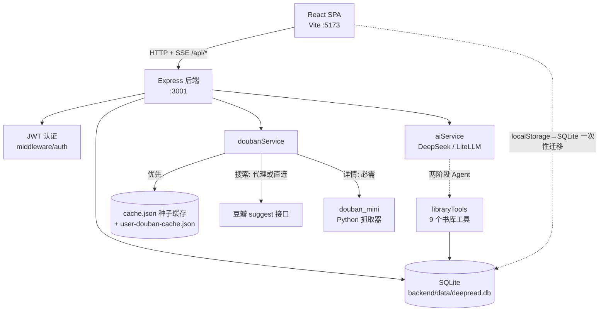

# 系统架构全景（Architecture Overview）

本文只记录"看代码看不出来"的内容：系统全景、模块边界、关键数据链路与已知取舍。函数级细节请直接读源码。

## 1. 系统全景



前后端完全分离：前端是纯静态 SPA（可部署到 Netlify，见 `netlify.toml`），后端是独立 Node 进程，通过 `VITE_API_BASE`（默认 `http://localhost:3001/api`）连接。

## 2. 模块划分与依赖边界

| 模块 | 职责 | 依赖规则 |
|------|------|---------|
| `App.tsx` + `components/` | 视图渲染与交互 | 只能通过 `services/` 调后端，禁止直接 fetch 其他地址或写数据库 |
| `services/`（前端） | API 客户端 + Token 管理 | Token 存 localStorage，每次请求带 `Authorization` 头；`API_BASE` 只在 `authService.ts` 定义并导出，其余模块从它导入 |
| `hooks/` | 流式请求、防抖、打字机 | 纯逻辑复用层，可调 `services/` |
| `backend/src/routes/` | HTTP 端点 | books / profile / ai / douban 四个路由挂载时统一 `router.use(requireAuth)`；仅 `/api/auth/register`、`/api/auth/login`、`/api/health` 免鉴权 |
| `backend/src/services/` | 业务逻辑 | `aiService`（AI 调用 + Agent 循环）、`doubanService`（豆瓣数据源）、`libraryTools`（Agent 工具实现） |
| `backend/src/prompts/` | 提示词模板 | 与 AI 功能一一对应，与路由代码分离 |
| `backend/src/db/database.ts` | SQLite 建表与访问 | 所有表结构集中于此，`CREATE TABLE IF NOT EXISTS` |

注意：`services/geminiService.ts` 是历史命名，它现在调用的是后端 `/api/ai/*` 端点，与 Gemini 无关。

**请求校验的真实现状**（三种写法并存，勿假设统一门槛存在）：`ai.ts` 用 `validate(schema)` 中间件——注意它是 `routes/ai.ts` 内的局部函数，未导出，其他路由文件 import 不到；`auth.ts` / `books.ts` 在处理器内直接 `schema.parse(req.body)`；`douban.ts` 的 search / batch / cover / find 端点直接解构 `req.query` / `req.body`，未过 Zod。新增写接口应带 schema，沿用所在文件的既有写法即可，不要为此重构范围外路由。唯一的例外是 `components/IngestionWizard.tsx:60` 内联了一份 `VITE_API_BASE`（拼封面代理 URL），改默认后端地址时容易被漏掉。

## 3. 关键数据流向

**登录认证**：`LoginPage` → `POST /api/auth/login` → 后端 bcrypt 校验 + 签发 JWT → 前端存 localStorage → 后续所有请求带 `Authorization: Bearer`。

**书库同步**：`App.tsx` 的 `useBookLibrary` 是书库唯一数据源。挂载时 `GET /api/books` 加载；保存走 `POST /api/books/batch` 全量同步（防抖）。首次登录且后端书库为空时，自动执行一次 localStorage → SQLite 迁移（标记键 `deepread_migrated_to_db`）。

**书籍导入**：`IngestionWizard` → `GET /api/douban/search` 搜豆瓣候选 → 用户选定版本（不自动选）→ `POST /api/ai/classify` AI 补全分类/难度 → 批量保存。

**AI 流式调用（Agent 两阶段）**：`POST /api/ai/*/stream` → `aiService.callAgentStream`：
1. **思考阶段**（静默、非流式）：多轮工具调用循环，模型通过 `libraryTools` 查询书库（`search_library`、`get_book_details`、`get_reading_taste_profile`、`update_book_status` 等 9 个工具），最多 3 轮（`MAX_ROUNDS` 硬编码在 `callAgentStream` 内）后截断；
2. **表达阶段**（流式）：基于工具收集的上下文，SSE 推送给用户。

SSE 语义事件协议（前端 `services/geminiService.ts` 解析）：
```
{ type: 'phase' | 'tool_call' | 'chunk' | 'reasoning' | 'book_update' | 'done' | 'error' }
```
所有流式端点在 compression 中间件中被跳过（见 `backend/src/index.ts` 的 filter），新增 `/stream` 端点天然继承此行为。

**推荐上下文的两个隐式契约**（断了不报错，只会变"哑"）：
- **画像必须一路透传**：`App.tsx` 的 `AppContent` 挂载时拉一次 `GET /api/profile`，再作为 prop 传给 `AIAdvisor` / `ReadingAssistant`，由它们放进请求体。任何一环漏传，后端 `【用户画像】` 段与 `get_user_profile` 工具就静默退化为空值，推荐照样出但不再个性化。
- **AI 写库靠前端落盘**：`update_book_status` 只在服务端内存副本上生效，并通过 SSE `book_update` 事件通知；真正写 SQLite 的是 `App.tsx` 监听 `aiBookUpdate` 后走 `useBookLibrary.setBooks` 的防抖全量保存。所以新增 AI 入口时若忘了派发该事件，模型会"说改了"而数据没变。

**统计口径单一实现**：`backend/src/services/libraryStats.ts` 的 `computeLibraryStats` 同时供 `buildLibraryOverview`（发给模型的概览）和 `GET /api/profile/stats`（统计页）使用。前端不再自行聚合数字，避免页面与模型看到两套口径。

**封面获取**：豆瓣图片有防盗链，封面统一经后端 `GET /api/douban/cover` 代理转发，前端通过 `getBookCoverUrl()` 辅助函数取值，不允许直接引用豆瓣原始 URL。

## 4. 核心抽象与设计模式

- **Agent 插槽式工具循环**：`aiService` 的循环不认识任何具体工具，只做 `tool_calls` → 执行 → 回传。新增能力只需在 `libraryTools.ts` 加一个工具定义，不改循环代码。
- **AI 双通道**：优先走 `LITELLM_BASE_URL`（OpenAI 兼容 HTTP + fetch，支持 reasoning 与 tool_calls 增量收集），未配置时回退 DeepSeek SDK。两者在 `aiService` 内收敛为统一接口。
- **统一错误结构**：业务错误抛 `AppError`（含 statusCode/code/details），全局错误中间件统一输出 `{ success: false, error, code, details }`；Zod 校验失败同样映射到该结构。
- **常驻注入按书库规模分档**：`buildLibraryOverview` 对 ≤100 本注入完整书名索引，101–300 本注入"在读 + 最近读完 + 各分类最新 3 本"的节选，>300 本不注入书名。三档都在标题里显式写明覆盖了多少本，模型据此判断是否必须调工具——不给声明时它会拿节选当全集。
- **豆瓣数据三条独立链路**（不要笼统说"缓存优先，代理兜底"）：
  - **搜索** `searchBooks` → **始终走网络**：配了 `DOUBAN_PROXY_URL` 先试代理（重试 3 次），再直连豆瓣 suggest 接口（重试 3 次）。开头虽调用 `loadCache()`，但那只是预备本地详情缓存，搜索结果本身不查缓存、不回写。不需要 Python。
  - **详情** `getBookDetail` → 先查内存缓存（根目录 `cache.json` 全局种子缓存 + `backend/data/user-douban-cache.json` 用户缓存，两者均本地文件不入库）；未命中只能由 `douban_mini` Python 抓取器实时抓取并回写用户缓存，**Node 侧无兜底**，缺 Python 即失败。
  - **封面**：`GET /api/douban/cover` 后端转发，绕过豆瓣防盗链。

## 5. 外部依赖与集成点

| 依赖 | 用途 | 配置 |
|------|------|------|
| DeepSeek API / LiteLLM 网关 | LLM 推理 | `DEEPSEEK_API_KEY` 或 `LITELLM_BASE_URL`（二者至少配一个，否则 AI 功能不可用） |
| 外部豆瓣代理 | 搜索 / 详情 / 封面防盗链 | `DOUBAN_PROXY_URL`；代码内默认值为空字符串（不配即无代理），示例地址见 `backend/.env.example` |
| douban_mini（Python） | 代理不可用时的直接抓取兜底 | 子进程调用 `python`/`python3`，需 `aiohttp beautifulsoup4 lxml`；缺 Python 自动降级 |
| Netlify | 前端静态托管 | `netlify.toml`，SPA 全量重定向 |

## 6. 技术债务与已知取舍

- **无数据库迁移系统**：表结构只有 `CREATE TABLE IF NOT EXISTS`，给已有表加列不会生效，需手工 `ALTER TABLE` 或删除 `backend/data/deepread.db` 重建。
- **无自动化测试**：后端 devDependencies 里有 vitest 但仓库没有任何测试文件；`npm run lint` 因缺少 ESLint 配置文件无法执行。当前验证手段是 `npm run build`（前后端）+ `backend/test-*.js` 手工脚本（需服务已启动，多数直连真实 AI API 会消耗 token）。
- **前端代码在仓库根目录**：`App.tsx`、`components/`、`services/` 等都在根目录而非 `src/`（历史原因，`src/` 仅存 `vite-env.d.ts`）。新文件遵循现有布局。
- **构建产物单 chunk 警告**：`vite build` 产出单 JS chunk 约 579KB（>500KB 警告），未做代码分割，属已知可接受状态。
- **没有阅读行为流水**：每日阅读热力图只能按 `startDate` / `completionDate` 两个离散事件计数（早先是按进度 `Math.random()` 模拟，已移除）。要做真正的"每天读了多久"需要新增行为表 + 打卡写入，属路线图 O5 范畴。
- **认证 Token 存 localStorage**：实现简单但存在 XSS 暴露面，若未来做多端同步需评估改用 HttpOnly Cookie。
- **前端构建无类型检查**：根目录 `npm run build` 仅 vite 打包；根 tsconfig 的 `npx tsc --noEmit` 长期不绿（历史积累的未使用变量告警）。前端改动的验证以构建通过 + 手工冒烟为准。
- **历史命名**：`services/geminiService.ts`（实为后端 AI API 客户端）——名字与直觉不符，改动前先确认。
