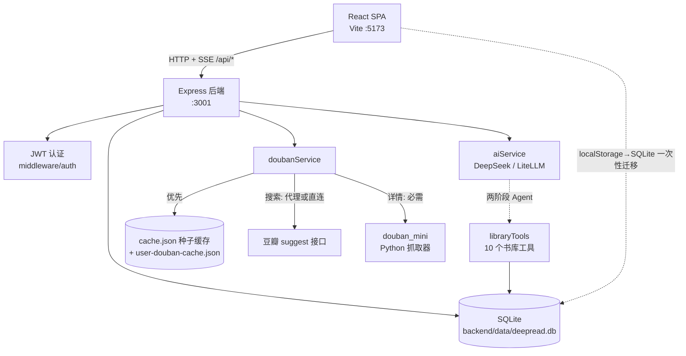

# 系统架构全景（Architecture Overview）

本文只记录"看代码看不出来"的内容：系统全景、模块边界、关键数据链路与已知取舍。函数级细节请直接读源码。

## 1. 系统全景



前后端完全分离：前端是纯静态 SPA（可部署到 Netlify，见 `netlify.toml`），后端是独立 Node 进程，通过 `VITE_API_BASE`（默认 `http://localhost:3001/api`）连接。

## 2. 模块划分与依赖边界

| 模块 | 职责 | 依赖规则 |
|------|------|---------|
| `App.tsx` + `components/` | 视图渲染与交互 | 只能通过 `services/` 调后端，禁止直接 fetch 其他地址或写数据库 |
| `services/`（前端） | API 客户端 + Token 管理 | Token 存 localStorage，每次请求带 `Authorization` 头；`API_BASE` 只在 `authService.ts` 定义并导出，其余模块从它导入。两个客户端按域分工：`geminiService.ts`（历史命名，实为 `/api/ai/*` + SSE 解析）管 AI，`librarianService.ts` 管批量入库与分类元数据（`/api/books/batch`、`/api/books/auto-categorize`、`/api/profile/category-meta`），`useBookLibrary` 直接依赖后者 |
| `hooks/` | 流式请求、防抖、打字机 | 纯逻辑复用层，可调 `services/` |
| `backend/src/routes/` | HTTP 端点 | books / profile / ai / douban 四个路由挂载时统一 `router.use(requireAuth)`；仅 `/api/auth/register`、`/api/auth/login`、`/api/health` 免鉴权 |
| `backend/src/services/` | 业务逻辑 | `aiService`（AI 调用 + Agent 循环）、`doubanService`（豆瓣数据源）、`libraryTools`（Agent 的 10 个书库工具 + 常驻书库概览）、`recommendValidation`（推荐输出回传前的 bookId 清洗）、`libraryStats`（统计口径唯一实现） |
| `backend/src/prompts/` | 提示词模板 | 与 AI 功能一一对应，与路由代码分离 |
| `backend/src/db/database.ts` | SQLite 建表与访问 | 所有表结构集中于此，`CREATE TABLE IF NOT EXISTS`；`BookRow` / `rowToBook` / `bookToParams` / `loadUserLibrary` 等行级读写辅助也在这里，`books` 路由与 Agent 工具共用同一份，不再各写一套。画像同理：`loadUserProfile` / `updateUserProfileInDb` 被 `GET/PUT /api/profile` 与 Agent 的 `update_user_profile` 共用；`addRecommendationFeedback` / `listRecommendationFeedback` 是推荐采纳反馈的唯一读写口 |

注意：`services/geminiService.ts` 是历史命名，它现在调用的是后端 `/api/ai/*` 端点，与 Gemini 无关。

**请求校验的真实现状**（三种写法并存，勿假设统一门槛存在）：`ai.ts` 用 `validate(schema)` 中间件——注意它是 `routes/ai.ts` 内的局部函数，未导出，其他路由文件 import 不到；`auth.ts` / `books.ts` 在处理器内直接 `schema.parse(req.body)`；`douban.ts` 的 search / batch / cover / find 端点直接解构 `req.query` / `req.body`，未过 Zod。新增写接口应带 schema，沿用所在文件的既有写法即可，不要为此重构范围外路由。唯一的例外是 `components/IngestionWizard.tsx:60` 内联了一份 `VITE_API_BASE`（拼封面代理 URL），改默认后端地址时容易被漏掉。

## 3. 关键数据流向

**登录认证**：`LoginPage` → `POST /api/auth/login` → 后端 bcrypt 校验 + 签发 JWT → 前端存 localStorage → 后续所有请求带 `Authorization: Bearer`。

**书库同步**：`App.tsx` 的 `useBookLibrary` 是书库唯一数据源。挂载时 `GET /api/books` 加载；保存走 `POST /api/books/batch` 全量同步（防抖）。首次登录且后端书库为空时，自动执行一次 localStorage → SQLite 迁移（标记键 `deepread_migrated_to_db`）。

**书籍导入**：`IngestionWizard` → `GET /api/douban/search` 搜豆瓣候选 → 用户选定版本（不自动选）→ `POST /api/ai/classify` AI 补全分类/难度 → 批量保存。

**AI 流式调用（Agent 两阶段）**：`POST /api/ai/*/stream` → 路由先 `createAgentContext(req.user!.id)` 从 SQLite 载入该用户的书库与画像 → `aiService.callAgentStream({ systemPrompt, userPrompt, ctx, handlers, ... })`（原先 13 个位置参数已收敛成这一个 options 对象）：
1. **思考阶段**（静默、非流式）：多轮工具调用循环，模型通过 `libraryTools` 查询书库（`search_library`、`get_book_details`、`get_reading_taste_profile`、`update_book_status`、`update_user_profile` 等 10 个工具），最多 3 轮（`MAX_ROUNDS` 硬编码在 `callAgentStream` 内）后截断。推荐端点额外带 `requireLibraryTool`：模型声称给出了 `libraryMatches` 却一次书目工具都没调，就追加一条纠正消息补 1 轮强制查证（上限 1 轮，不影响其它端点）；
2. **表达阶段**（流式）：基于工具收集的上下文，SSE 推送给用户。

SSE 语义事件协议（前端 `services/geminiService.ts` 解析）：
```
{ type: 'phase' | 'tool_call' | 'chunk' | 'reasoning' | 'book_update' | 'done' | 'error' }
```
所有流式端点在 compression 中间件中被跳过（见 `backend/src/index.ts` 的 filter），新增 `/stream` 端点天然继承此行为。

**Agent 的数据来源契约**（改错了不报错，只会变"哑"或丢数据）：
- **书库与画像只有一个真源**：流式端点跑的是带工具的 Agent，能读能写，所以它们的书库/画像一律由后端从 SQLite 载入（`createAgentContext(userId)`），请求体里**不再传 `library` / `userProfile`**，客户端传了也不作数。这样 Agent 看到的和用户界面上的是同一份数据。仍然走请求体的只有"用户在界面上勾选的那批书"（`reading-path` 的 `books`、classify / reorganize 的 `titles`）——那是请求参数，不是书库。
- **AI 写库直接落 SQLite，`book_update` 是反向通知**：`update_book_status` 立刻按 `user_id` 分区 `UPDATE`，并清空本次请求的工具缓存，让后续工具读到新值。`book_update` 事件的作用不再是"让前端去写库"，而是"告知客户端它那份内存副本已过期"——`App.tsx` 监听 `aiBookUpdate` 把改动 patch 回 `useBookLibrary`。**漏接不会丢 AI 的写入，但客户端下一次防抖全量保存会把它冲掉**，所以 `routes/ai.ts` 的 `sseHandlers()` 对全部流式端点一律接上 `onBookUpdate`，不做取舍。
- **非流式端点仍可自带书库**：`/classify`、`/recommend` 等只走 `callAI`、不带工具循环、改不了库，客户端传来的 `library` 在那里是无害的请求数据，未纳入上述契约。
- **推荐结果在回传前对齐真实书库**：`recommendValidation.validateAdvisorJson` 逐条核对 `libraryMatches` 的 `bookId`，对不上就用模型同时给出的 `title` 反查修复，修不掉才丢弃，并把 `kept / repaired / dropped / droppedTitles` 塞进响应的 `matchValidation`。这一步有效的前提是**客户端渲染的是 `done` 里那份返回值而不是 chunk 原文**；提示词因此强制要求每条 `libraryMatches` 带 `title`，少这个字段就无从自愈。`externalMatches` 是站外新书、天然没有 bookId，不清洗。
- **画像写入只有一个函数**：`updateUserProfileInDb` 只写 `!== undefined` 的字段，REST `PUT /api/profile` 与 Agent 的 `update_user_profile` 共用它，所以调用方必须只发自己要改的字段。整份旧快照 PUT 回去会把 AI 刚写进去的字段按旧值冲掉——设置页表单因此改成"只发自己拥有的 4 个字段 + 进页时重新 `fetchProfile`"。
- **采纳反馈只有显式点击**：`POST/GET /api/ai/recommend-feedback` 写读 `recommendation_feedback`（想读 / 跳过）。同一本书改选是**追加新行**、最新一条即最终态度，不做 UPSERT。注意它没记"展示了哪些"，所以还算不出严格采纳率（缺分母）。

**统计口径单一实现**：`backend/src/services/libraryStats.ts` 的 `computeLibraryStats` 同时供 `buildLibraryOverview`（发给模型的概览）和 `GET /api/profile/stats`（统计页）使用。前端不再自行聚合数字，避免页面与模型看到两套口径。

**封面获取**：豆瓣图片有防盗链，封面统一经后端 `GET /api/douban/cover` 代理转发，前端通过 `getBookCoverUrl()` 辅助函数取值，不允许直接引用豆瓣原始 URL。

## 4. 核心抽象与设计模式

- **Agent 插槽式工具循环**：`aiService` 的循环不认识任何具体工具，只做 `tool_calls` → 执行 → 回传。但"加一个工具只改一处"是幻觉：`libraryTools.ts` 里定义、`isWriteTool()`、`describeToolCall()`、`executeLibraryTool()` 的 case 四处都要动，漏掉 `isWriteTool` 会让写工具的结果被本次请求的缓存吞掉（写进去了、模型却继续按旧值回答）。循环对工具唯一的特判是 `isLibraryCatalogTool()` —— 它决定"这次算不算真查过书目"，画像类工具明确不算，否则一次 `get_user_profile` 就能蒙过硬闸门。
- **工具缓存与 Web 用量是请求作用域**：`toolCache`、`webCalls`、`webCostUsd` 挂在 `AgentContext` 上，每个请求一份，随请求结束一起回收。早先它们是模块级全局，等于跨用户共享缓存、配额计数跨请求累计——单用户自测看不出问题，多用户下缓存会命中别人的书、次数限制会莫名其妙提前触发。例外是 `webSearchService` 里的搜索结果缓存：键是查询词、值是对公开网页的检索结果，不掺用户数据，跨请求共享是收益不是泄漏，所以仍是进程级。
- **AI 双通道**：优先走 `LITELLM_BASE_URL`（OpenAI 兼容 HTTP + fetch，支持 reasoning 与 tool_calls 增量收集），未配置时回退 DeepSeek SDK。两者在 `aiService` 内收敛为统一接口。
- **统一错误结构**：业务错误抛 `AppError`（含 statusCode/code/details），全局错误中间件统一输出 `{ success: false, error, code, details }`；Zod 校验失败同样映射到该结构。
- **常驻注入按书库规模分档**：`buildLibraryOverview` 对 ≤100 本注入完整书名索引，101–300 本注入"在读 + 最近读完 + 各分类最新 3 本"的节选，>300 本不注入书名。三档都在标题里显式写明覆盖了多少本，模型据此判断是否必须调工具——不给声明时它会拿节选当全集。
- **豆瓣数据三条独立链路**（不要笼统说"缓存优先，代理兜底"）：
  - **搜索** `searchBooks` → **始终走网络**：配了 `DOUBAN_PROXY_URL` 先试代理（重试 3 次），再直连豆瓣 suggest 接口（重试 3 次）。开头虽调用 `loadCache()`，但那只是预备本地详情缓存，搜索结果本身不查缓存、不回写。不需要 Python。
  - **详情** `getBookDetail` → 先查内存缓存（根目录 `cache.json` 全局种子缓存 + `backend/data/user-douban-cache.json` 用户缓存，两者均本地文件不入库）；未命中只能由 `douban_mini` Python 抓取器实时抓取并回写用户缓存，**Node 侧无兜底**，缺 Python 即失败。
  - **封面**：`GET /api/douban/cover` 后端转发，绕过豆瓣防盗链。

## 5. 外部依赖与集成点

| 依赖 | 用途 | 配置 |
|------|------|------|
| DeepSeek API / LiteLLM 网关 | LLM 推理 | `DEEPSEEK_API_KEY` 或 `LITELLM_BASE_URL`（二者至少配一个，否则 AI 功能不可用） |
| 外部豆瓣代理 | 搜索 / 详情 / 封面防盗链 | `DOUBAN_PROXY_URL`；代码内默认值为空字符串（不配即无代理），示例地址见 `backend/.env.example` |
| douban_mini（Python） | 代理不可用时的直接抓取兜底 | 子进程调用 `python`/`python3`，需 `aiohttp beautifulsoup4 lxml`；缺 Python 自动降级 |
| Netlify | 前端静态托管 | `netlify.toml`，SPA 全量重定向 |

## 6. 技术债务与已知取舍

- **无数据库迁移系统**：表结构只有 `CREATE TABLE IF NOT EXISTS`，给已有表加列不会生效，需手工 `ALTER TABLE` 或删除 `backend/data/deepread.db` 重建。**加新表不受此限制**：`initDatabase()` 每次启动都跑一遍，新表会自动补上（`recommendation_feedback` 就是这么上线的）。
- **推荐质量还缺可度量的闭环**：`recommendation_feedback` 只记显式的想读 / 跳过，没记"这次一共展示了哪几本"，所以算不出严格采纳率；也没有人工打分的评估集，任何提示词改动都只能靠肉眼比对。已记录的 `matchValidation` 是这条闭环目前唯一能自动跑出来的数字。
- **无自动化测试**：后端 devDependencies 里有 vitest 但仓库没有任何测试文件；`npm run lint` 因缺少 ESLint 配置文件无法执行。当前验证手段是 `npm run build`（前后端）+ `backend/test-*.js` 手工脚本（需服务已启动，多数直连真实 AI API 会消耗 token）。
- **前端代码在仓库根目录**：`App.tsx`、`components/`、`services/` 等都在根目录而非 `src/`（历史原因，`src/` 仅存 `vite-env.d.ts`）。新文件遵循现有布局。
- **构建产物单 chunk 警告**：`vite build` 产出单 JS chunk 约 579KB（>500KB 警告），未做代码分割，属已知可接受状态。
- **没有阅读行为流水**：每日阅读热力图只能按 `startDate` / `completionDate` 两个离散事件计数（早先是按进度 `Math.random()` 模拟，已移除）。要做真正的"每天读了多久"需要新增行为表 + 打卡写入，属路线图 O5 范畴。
- **认证 Token 存 localStorage**：实现简单但存在 XSS 暴露面，若未来做多端同步需评估改用 HttpOnly Cookie。
- **前端构建无类型检查**：根目录 `npm run build` 仅 vite 打包；根 tsconfig 的 `npx tsc --noEmit` 长期不绿（历史积累的未使用变量告警）。前端改动的验证以构建通过 + 手工冒烟为准。
- **历史命名**：`services/geminiService.ts`（实为后端 AI API 客户端）——名字与直觉不符，改动前先确认。
